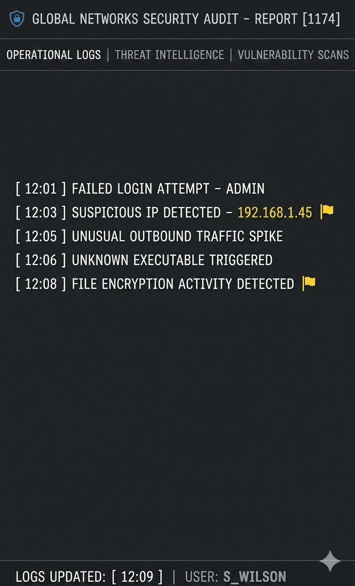

# cyber-attack-simulation-incident-response
Cybersecurity project simulating a large-scale cyber attack and incident response strategy
## 📊 Log Analysis

The following log data was analyzed to identify potential security threats during the simulated attack.

### 🔍 Key Observations:
- Multiple failed login attempts indicate possible brute-force activity  
- Suspicious IP detected: **192.168.1.45**  
- Unusual outbound traffic suggests possible data exfiltration  
- File encryption activity indicates ransomware behavior  

### 📸 Log Screenshot

